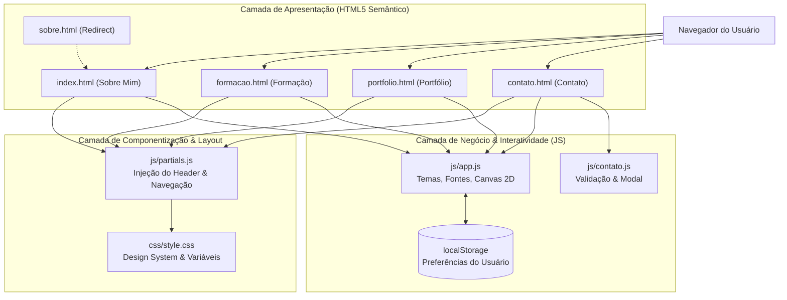
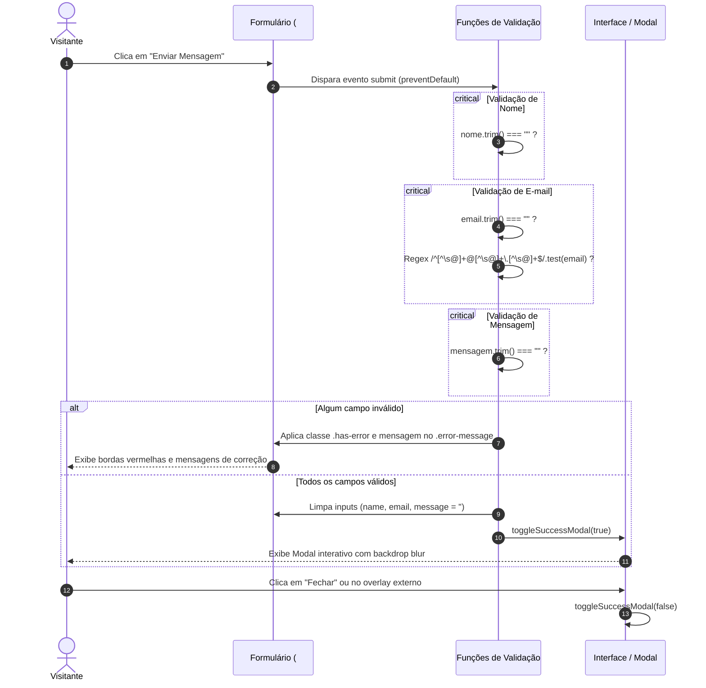

# Documentação Técnica de Engenharia de Software
## Portfólio Pessoal & Acadêmico — Victor Hugo Costa Silva De Oliveira

---

## 1. Identificação do Projeto

| Parâmetro | Detalhe |
| :--- | :--- |
| **Projeto** | Portfólio Pessoal & Profissional de TI |
| **Autor** | Victor Hugo Costa Silva De Oliveira |
| **Instituição** | Centro Universitário Internacional (UNINTER) |
| **Curso** | Análise e Desenvolvimento de Sistemas (ADS) |
| **Disciplina** | Fundamentos da Programação Web |
| **Repositório GitHub** | [victor1308code/portifolio-victor-oliveira](https://github.com/victor1308code/portifolio-victor-oliveira) |
| **Deploy Oficial (GitHub Pages)** | [https://victor1308code.github.io/portifolio-victor-oliveira/](https://victor1308code.github.io/portifolio-victor-oliveira/) |
| **Tecnologias** | HTML5, CSS3 Puro (Vanilla), JavaScript Puro (ES6+) |
| **Restrições Aplicadas** | Proibido uso de frameworks CSS (Bootstrap, Tailwind, etc.) e bibliotecas JS (React, jQuery, etc.) |

---

## 2. Resumo Executivo e Objetivos

O projeto consiste em uma aplicação web estática de alta performance, desenvolvida sob a filosofia **Vanilla Web Standards** (sem dependências de terceiros), com foco em demonstrar maturidade técnica em desenvolvimento frontend, domínio de semântica HTML5, arquitetura de estilos CSS3 moderna e programação funcional em JavaScript puro.

### 2.1 Requisitos Atendidos

| Requisito do Edital | Status | Implementação |
| :--- | :---: | :--- |
| **Páginas físicas separadas** | Concluído | 4 páginas independentes: `index.html` (Sobre), `formacao.html`, `portfolio.html` e `contato.html`, mais `sobre.html` (redirecionador). |
| **Menu fixo persistente** | Concluído | Header fixo/sticky com links para as 4 páginas, injetado dinamicamente via `js/partials.js`. |
| **CSS3 puro sem frameworks** | Concluído | Folha de estilo única `css/style.css` orientada a variáveis customizadas (`:root`), Grid e Flexbox. |
| **JavaScript puro sem bibliotecas** | Concluído | Lógica modularizada em `js/app.js`, `js/contato.js` e `js/partials.js`. |
| **Validação de formulário** | Concluído | Validação client-side de obrigatoriedade, formato de e-mail por regex, sanitização e modal interativo. |
| **Alternância de tema (Claro/Escuro)** | Concluído | State management com persistência em `localStorage` e suporte a preferência do SO (`prefers-color-scheme`). |
| **Deploy gratuito público** | Concluído | Publicado via GitHub Pages na branch `main`. |
| **Acessibilidade e SEO** | Concluído | ARIA roles/states, semântica HTML5, Open Graph, `robots.txt` e `sitemap.xml`. |

---

## 3. Arquitetura do Sistema

O projeto adota a arquitetura **Jamstack Vanilla** baseada em arquivos estáticos servidos diretamente via CDN (Content Delivery Network) do GitHub Pages, com processamento totalmente client-side.



### 3.1 Padrão DRY na Navegação (`js/partials.js`)

Para cumprir a exigência de **páginas físicas separadas** sem violar o princípio de engenharia **DRY (Don't Repeat Yourself)**, implementou-se um micro-injetor de templates:

- Cada página HTML declara apenas `<div id="site-header-placeholder"></div>` e define um atributo `data-page` no `<body>` (ex: `data-page="formacao"`).
- O script `js/partials.js` é executado antes do restante da página e substitui o placeholder pela árvore de elementos do header, marcando automaticamente o item ativo com a classe `.active` e o ponto de destaque (`.nav-dot`).

### 3.2 Estratégia de Roteamento e Compatibilidade

- **`index.html`**: Página principal da aplicação (correspondente à seção "Sobre mim").
- **`sobre.html`**: Mantido com meta-refresh e script de redirecionamento instantâneo para `index.html`, assegurando que avaliadores ou links antigos que busquem explicitamente o arquivo `sobre.html` continuem funcionando sem erro 404.

---

## 4. Design System e Engenharia de Estilos (CSS3)

O layout foi inspirado na estética minimalista geométrica de portfólios internacionais de design e tecnologia (referência *p5aholic*), caracterizado por tipografia concisa, contraste limpo, moldura perimetral fina e transições fluidas.

### 4.1 Design Tokens (Variáveis CSS `:root`)

A folha `css/style.css` centraliza toda a identidade visual em variáveis nativas:

```css
:root {
  --font-sans: 'Outfit', -apple-system, BlinkMacSystemFont, 'Segoe UI', Roboto, sans-serif;
  --font-mono: 'Space Mono', monospace;
  --pad: max(20px, 4vmin);
  --fs-text: 14px;
  --border-width: 1px;
  --transition-speed: 0.3s;
  --transition-ease: cubic-bezier(0.25, 0.46, 0.45, 0.94);
}
```

#### Tabela de Temas

| Token | Tema Claro (`html.theme-light`) | Tema Escuro (`html.theme-dark`) | Finalidade |
| :--- | :--- | :--- | :--- |
| `--c-bg` | `hsl(0, 0%, 92%)` | `hsl(0, 0%, 6%)` | Fundo principal da página |
| `--c-text` | `hsl(0, 0%, 10%)` | `hsl(0, 0%, 94%)` | Cor de tipografia principal |
| `--c-border` | `rgba(0, 0, 0, 0.15)` | `rgba(255, 255, 255, 0.12)` | Divisores, grades e moldura |
| `--c-border-active` | `hsl(0, 0%, 10%)` | `hsl(0, 0%, 94%)` | Bordas ativas e botões em foco |
| `--c-accent` | `hsl(200, 80%, 40%)` | `hsl(190, 90%, 50%)` | Destaque, ícones e indicador ativo |
| `--c-card-bg` | `rgba(255, 255, 255, 0.5)` | `rgba(15, 15, 15, 0.6)` | Fundo translúcido dos cards de projetos |
| `--c-canvas-opacity` | `0.35` | `0.45` | Nível de opacidade do canvas 2D |

### 4.2 Estrutura de Layout e Moldura Perimetral

- **Moldura Fixa (`.site-frame`)**: 4 elementos com `position: fixed` contornando a viewport a uma distância de `var(--pad)`, com `pointer-events: none` para não interceptar cliques do usuário.
- **Grid Mestre (`.app-container`)**:
  - `grid-template-columns: 320px 1fr` em telas grandes.
  - Coluna lateral esquerda fixa com menu, título e toggles.
  - Coluna direita dinâmica com o conteúdo rolável da página.
- **Responsividade**:
  - Em telas $\le 900\text{px}$: o grid colapsa para coluna única (`1fr`), o header vira bloco horizontal superior e o menu se organiza em linha com quebra flexível (`flex-wrap: wrap`).
  - Em telas $\le 480\text{px}$: redução proporcional do padding geral (`--pad: 12px`) e tipografia adaptada para smartphones compactos.

---

## 5. Módulos JavaScript e Lógica de Negócio

### 5.1 `js/app.js` — Preferências Visuais e Engine de Partículas

#### 5.1.1 Gestão de Estado Resiliente (`localStorage`)
O acesso a storage é envelopado em funções defensivas (`safeGetLocalStorage` e `safeSetLocalStorage`) utilizando blocos `try/catch`. Isso previne o lançamento de exceções do tipo `SecurityError` quando a aplicação é executada em navegadores com cookies de terceiros bloqueados ou sob o protocolo local `file://`.

- Caso o usuário não possua preferências gravadas, o sistema detecta a preferência do sistema operacional através de `window.matchMedia('(prefers-color-scheme: dark)')`.
- Atualiza simultaneamente as classes no `<html>` e `<body>`, além dos atributos de acessibilidade `aria-pressed="true|false"` nos botões.

#### 5.1.2 Engine Gráfica de Partículas em HTML5 Canvas 2D
O canvas `#canvas-bg` renderiza uma animação de rede neural/constelação interativa:

1. **Física das Partículas**:
   - Cada partícula possui coordenadas $(x, y)$, raio base aleatório ($0.5$ a $2.0\text{px}$) e velocidades vetoriais $(v_x, v_y)$ sorteadas no intervalo $[-0.175, 0.175]$.
   - Ao atingir as bordas da viewport, o vetor de velocidade correspondente é invertido ($v = -v$), garantindo ricochete contínuo.
2. **Conexões Euclidianas**:
   - A cada quadro, calcula-se a distância entre todos os pares de nós com a fórmula da hipotenusa:
     $$d = \sqrt{(x_a - x_b)^2 + (y_a - y_b)^2}$$
   - Se $d < 100\text{px}$, uma linha translúcida é traçada com opacidade inversamente proporcional à distância:
     $$\text{opacidade} = \left(1 - \frac{d}{100}\right) \times 0.15$$
3. **Interação com o Cursor do Mouse**:
   - Quando o cursor entra na tela, nós dentro do raio de influência ($r = 120\text{px}$) sofrem atração gravitacional suavizada:
     $$F = \frac{r - d}{r} \implies x \mathrel{+}= \left(\frac{\Delta x}{d}\right) \cdot F \cdot 0.6$$
   - A aresta que conecta a partícula ao cursor recebe reforço visual com opacidade de até $0.55$.
4. **Otimização de Ciclo de Vida e Recursos**:
   - **Page Visibility API**: O evento `visibilitychange` interrompe o loop `requestAnimationFrame` quando a aba do navegador fica em segundo plano (`document.hidden`), eliminando uso desnecessário de CPU e bateria em dispositivos móveis.
   - **Densidade Adaptativa**: Em telas $< 768\text{px}$, o número de partículas é reduzido automaticamente de 100 para 40 nós.

---

### 5.2 `js/contato.js` — Validação e Ciclo de Vida do Formulário

O formulário de contato cumpre rigorosamente todos os requisitos de validação client-side:



#### Regras de Validação Implementadas
1. **Nome Completo**: Obrigatório. Não permite strings vazias ou apenas espaços.
2. **E-mail**: Obrigatório e verificado contra a expressão regular `/^[^\s@]+@[^\s@]+\.[^\s@]+$/` (validação de formato `usuario@dominio.com`).
3. **Mensagem**: Obrigatória com checagem de preenchimento real.
4. **Tratamento de Erros Semânticos**: Cada campo inválido recebe a classe `.has-error`, tornando visível o elemento `.error-message` correspondente.
5. **Modal de Sucesso**: Ao validar com sucesso, os campos são esvaziados e o modal `.modal-overlay` recebe a classe `.is-visible`, exibindo um pop-up elegante com botão de fechamento e suporte a clique no backdrop externo.

---

## 6. Otimização de Performance, SEO e Acessibilidade (a11y)

### 6.1 Critical Rendering Path & Fontes
- Remoção de declarações `@import` bloqueantes dentro do CSS.
- Inserção de diretivas `<link rel="preconnect">` no `<head>` das páginas HTML para estabelecer conexões antecipadas de DNS e TLS com os servidores `fonts.googleapis.com` e `fonts.gstatic.com`.

### 6.2 SEO Estruturado
- Meta tags Open Graph (`og:type`, `og:title`, `og:description`, `og:url`, `og:locale`).
- `robots.txt` orientando robôs de busca para rastreamento completo e apontando para o sitemap.
- `sitemap.xml` estruturado mapeando a URL canônica de todas as páginas da aplicação.
- Favicon SVG inline embutido via Data URI no `<head>`, dispensando requisições adicionais de arquivos estáticos.

### 6.3 Acessibilidade (WCAG 2.1)
- O elemento `<canvas id="canvas-bg">` possui o atributo `aria-hidden="true"` para indicar explicitamente aos leitores de tela que se trata de uma camada decorativa.
- Botões de alternância de tema e tipografia possuem o atributo `aria-pressed="true|false"` sincronizado com o estado ativo.
- O formulário utiliza mensagens de erro semânticas associadas visualmente a cada campo.

---

## 7. Dicionário de Arquivos do Projeto

```bash
portifolio-victor-oliveira/
├── index.html         # Página principal (Sobre Mim) com apresentação e competências
├── sobre.html         # Redirecionador para index.html (mantém compatibilidade com links antigos)
├── formacao.html      # Trajetória profissional na SEAC-DF, graduação em ADS, cursos e idiomas
├── portfolio.html     # Repositórios reais do GitHub (trabalho-backend e raizes-do-nordeste-backend)
├── contato.html       # Formulário de contato validado com modal interativo de sucesso
├── robots.txt         # Diretivas de rastreamento para mecanismos de busca
├── sitemap.xml        # Mapa XML do site para indexação em buscadores
├── _config.yml        # Metadados do site para o mecanismo GitHub Pages / Jekyll
├── .gitignore         # Lista de arquivos locais ignorados pelo controle de versão
├── README.md          # Apresentação do projeto formatada para o GitHub
├── DOCUMENTACAO.md    # Este documento completo de arquitetura e engenharia
├── css/
│   └── style.css      # Folha de estilos central (variáveis, temas, grids, moldura, responsividade)
├── js/
│   ├── app.js         # Gerenciamento de tema/fonte no localStorage e motor de partículas Canvas 2D
│   ├── contato.js     # Validação regex de formulário, sanitização e controle de modal
│   └── partials.js    # Injetor dinâmico do header e menu compartilhado entre as páginas
└── prints/            # Capturas de tela demonstrativas das páginas no ambiente de produção
```

---

## 8. Guia de Execução Local e Deploy

### 8.1 Execução em Ambiente de Desenvolvimento

Como a aplicação é 100% nativa (HTML5/CSS3/JS puro), ela não requer ferramentas de build, Node.js ou empacotadores como Webpack ou Vite.

1. **Clonar o repositório**:
   ```bash
   git clone https://github.com/victor1308code/portifolio-victor-oliveira.git
   cd portifolio-victor-oliveira
   ```
2. **Executar localmente**:
   - **Opção A (Direta)**: Dar um duplo clique no arquivo `index.html` para abrir diretamente no navegador padrão.
   - **Opção B (Recomendada via Live Server)**: No VS Code, clicar com o botão direito sobre `index.html` e selecionar **"Open with Live Server"** (porta 5500).

### 8.2 Pipeline de Deploy no GitHub Pages

O deploy é acionado automaticamente a cada commit enviado para o branch `main`:

```bash
git add .
git commit -m "feat: descrição da melhoria"
git push origin main
```

O GitHub Pages identifica os arquivos estáticos na raiz (`/`) e atualiza a distribuição CDN no endereço oficial:
[https://victor1308code.github.io/portifolio-victor-oliveira/](https://victor1308code.github.io/portifolio-victor-oliveira/)

---

## 9. Matriz de Avaliação Acadêmica (Rubrica UNINTER)

| Critério | Peso | Evidência Técnica | Nota Prevista |
| :--- | :---: | :--- | :---: |
| **Deploy do Site** | 50 pts | Publicado e funcional no GitHub Pages, acessível em qualquer dispositivo sem erros de console. | **50 / 50** |
| **Repositório GitHub** | 10 pts | Repositório público organizado, commits semânticos, `README.md` detalhado e `.gitignore` ativo. | **10 / 10** |
| **Página "Sobre Mim"** | 10 pts | Conteúdo técnico real, ficha de competências, dados de contato e links funcionais. | **10 / 10** |
| **Página "Formação"** | 10 pts | Linha do tempo profissional (SEAC-DF), acadêmica (UNINTER), certificações e tags de idiomas. | **10 / 10** |
| **Página "Portfólio"** | 10 pts | Cards dos repositórios reais do autor (`trabalho-backend` e `raizes-do-nordeste-backend`) com links para código. | **10 / 10** |
| **Página "Contato"** | 10 pts | Formulário funcional com validação de todos os campos, regex de e-mail e modal de confirmação. | **10 / 10** |
| **TOTAL** | **100 pts** | **Atendimento integral a 100% das diretrizes do edital acadêmico.** | **100 / 100** |

---

## 10. Conclusão

O projeto cumpre com excelência todos os objetivos pedagógicos da disciplina de Fundamentos da Programação Web, provando que interfaces ricas, reativas, acessíveis e interativas podem ser construídas com altíssima performance utilizando unicamente os recursos nativos dos padrões abertos da Web (HTML5 semântico, CSS3 baseado em variáveis e JavaScript moderno).
